# 📊 Welcome to HisabKitab 

Welcome to **HisabKitab**, your comprehensive solution for managing transactions and inventory for your mart. This guide will walk you through the features and functionalities of the app, ensuring you can make the most of its capabilities.

## 📑 Table of Contents

1. [Getting Started](#getting-started)
2. [Dashboard Overview](#dashboard-overview)
3. [Key Features](#key-features)
   - [New Bill](#new-bill)
   - [My Stock](#my-stock)
   - [My Transactions](#my-transactions)
   - [My Customers](#my-customers)
   - [Return Item](#return-item)
   - [Add Products](#add-products)
4. [Analytics Dashboard](#analytics-dashboard)
5. [Settings](#settings)

## 🚀 Getting Started

### Admin Sign-Up

To begin using **HisabKitab**, you'll need to create an admin account:

1. Launch the **HisabKitab** app on your mobile device.
2. You will be presented with the **Sign-In** screen.

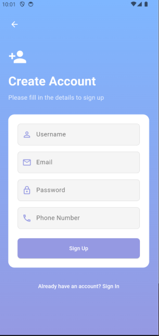

3. Since you're a new user, tap on the **"Don't have an account? Sign Up"** link at the bottom of the screen.
4. You'll be directed to the **Sign-Up** page.

#### Sign-Up Process

- **Enter Email**: Input your email address, which will be used for account recovery and notifications.
- **Create Password**: Choose a strong password (min. 8 characters, mix of letters, numbers, symbols).
- **Tap Sign Up**: After filling in your details, tap the **"Sign Up"** button to complete the registration.

> 💡 **Important Notes**:
> - Ensure you have a stable internet connection.
> - Use a valid email for verification and future communication.
> - Keep your login credentials secure.

Once you've signed up, you'll have admin access, allowing you to manage inventory, transactions, and other key features.

## 🏠 Dashboard Overview

Upon successful sign-up and login, you'll be greeted with the **Dashboard**.

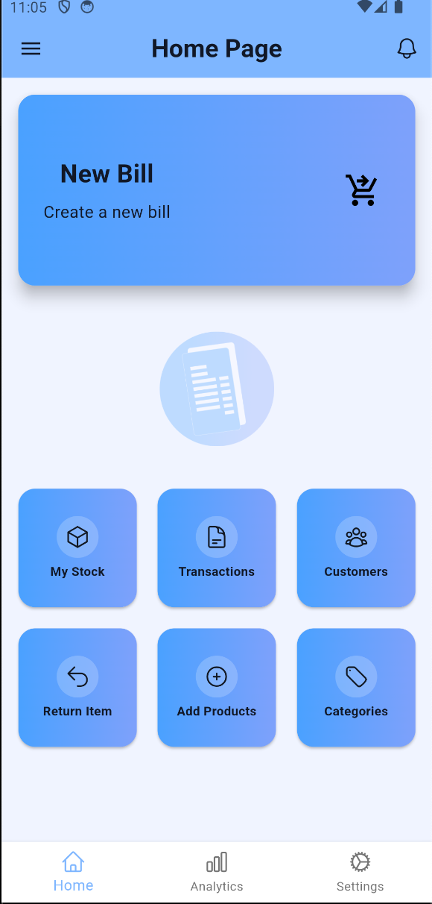

The main dashboard provides quick access to:

1. [New Bill](#new-bill): Create a new sales bill.
2. [My Stock](#my-stock): Manage your inventory.
3. [My Transactions](#my-transactions): View all transactions.
4. [My Customers](#my-customers): Manage customer information.
5. [Return Item](#return-item): Process item returns.
6. [Add Products](#add-products): Add new products to your inventory.

At the bottom, you will find navigation icons for **Home**, **Analytics**, and **Settings**.

### 👤 Admin Dashboard

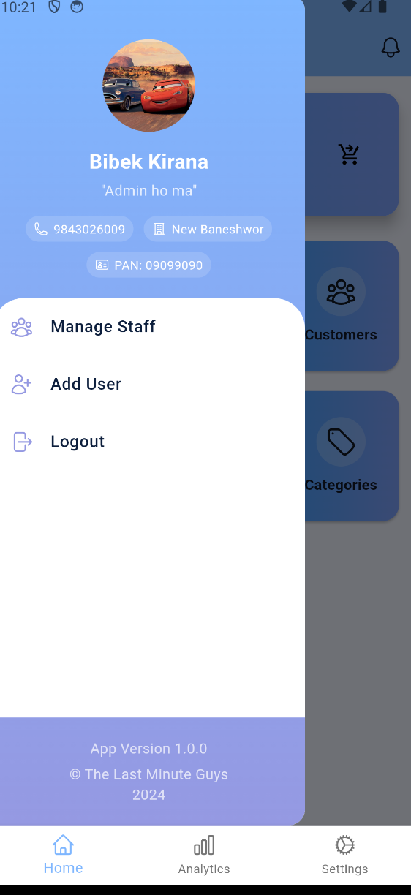

The **Admin Dashboard** allows you to manage your mart and access various features:

- **Profile Information**: Displays your username, address, phone number, and other details.
- **Manage Staff**: Access the staff management screen.
- **Add User**: Add new users to the system.
- **Logout**: Sign out of your account.

#### 👥 Managing Staff

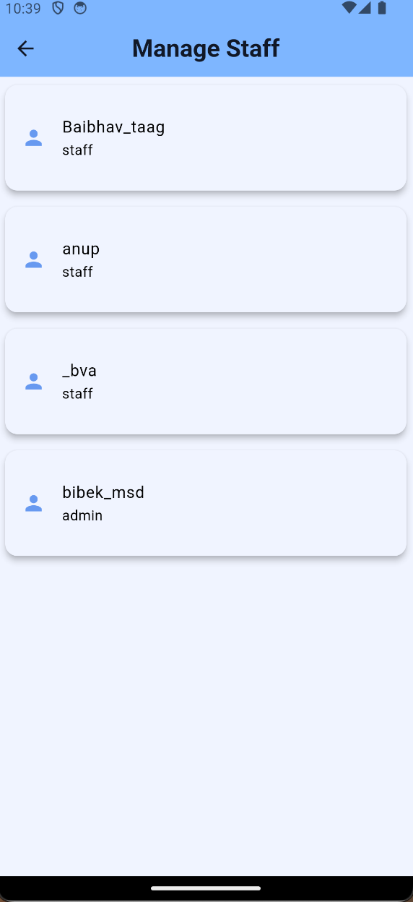

The **Manage Staff** screen allows you to view and manage all staff members associated with your mart.

##### Staff Details

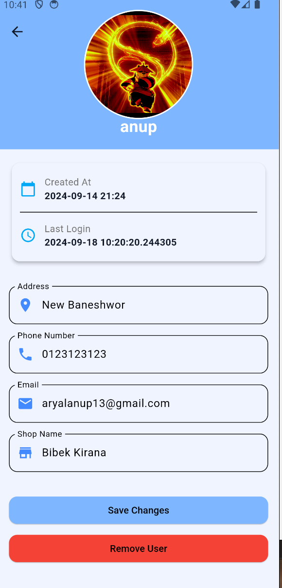

Clicking on a staff member's name will open their profile where you can:
- View creation date and last login time.
- Update their personal information (address, phone, email).
- Change their associated shop name.
- Save changes or remove the user from the system.

#### ➕ Adding New Users

To add a new staff member:

1. Navigate to the **Staff Sign-Up** screen.
2. Fill in the required fields:
   - Username
   - Email
   - Password
   - Phone Number
3. Tap the **Sign Up** button to create the account.

## 🔑 Key Features

### 🧾 New Bill

The **bill generation** feature allows users to create, manage, and finalize bills for customer purchases.

#### Naya Bill Screen (New Bill)

1. **Navigate to "Naya Bill" Screen**

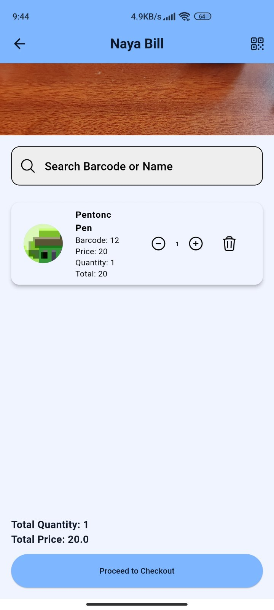

2. **Add Products** to the bill using one of the following methods:
    - 📷 Scan Barcode: Use the "Scan Barcode" feature to scan the product's barcode.
    - 🔍 Search Products: Manually search using the **"Search Barcode or Name"** field.

3. **Product Management Options:**
    - Adjust the quantity with the **"+"** and **"-"** buttons.
    - ✏️ Edit product details or apply discounts using the pencil icon.
    - 🗑️ Remove a product using the trash icon.

4. **Review Totals:**
    - The total quantity and price are automatically calculated and displayed at the bottom of the screen.

5. **Proceed to Checkout:**
    - Once all products are added, tap **"Proceed to Checkout"** to move to the next step.

#### Checkout Screen

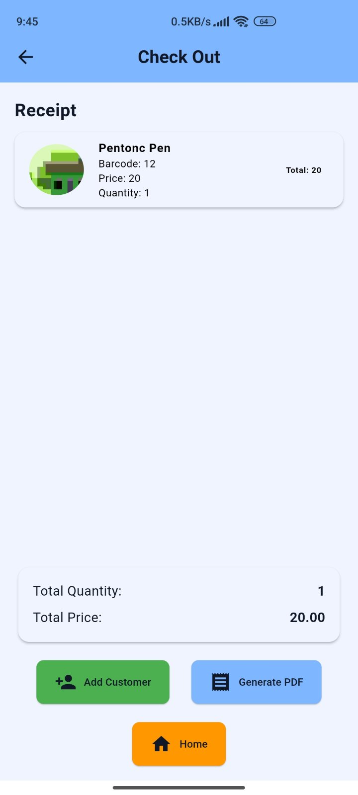

1. **Review Bill Details:**
      - Product name, barcode, price, quantity, and total price are shown.
      - Verify the total quantity and price at the bottom.

2. **Available Actions:**

      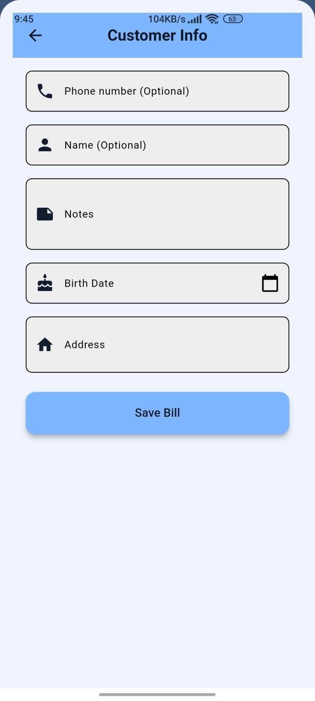

      - #### Add Customer
        - Tap **"Add Customer"** to include customer information.

      

        - Fill in optional fields such as:
          - Phone number
          - Name
          - Notes
          - Birth Date
          - Address
        - Tap **"Save Bill"** to store the bill with customer details in the database.

      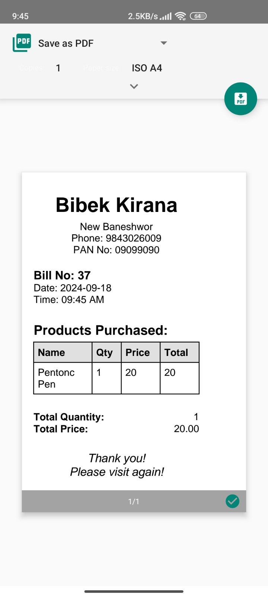

      - #### Generate PDF
          - Tap **"Generate PDF"** to create a printable receipt that includes:
            - Store details (name, address, phone, PAN No.)
            - Bill details (number, date, time)
            - Purchased products (name, quantity, price, total)
            - Total quantity and price
            - Thank you message
       
      - #### Home
          - Tap **"Home"** to return to the main dashboard once the transaction is complete.

### 📦 My Stock

The **My Stock** page provides a comprehensive view of your inventory:

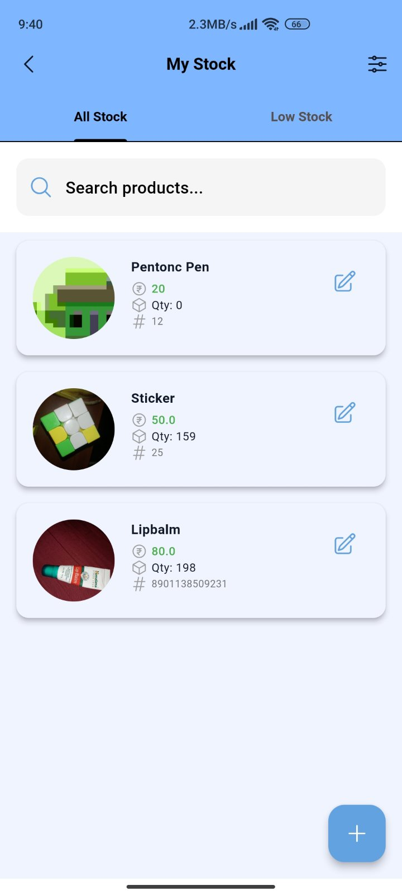

#### All Stock
- View all products in stock.
- 🔍 Search for specific items by name or barcode.
- 🏷️ Filter products by category.
- 📉 Toggle to view **Low Stock** items.

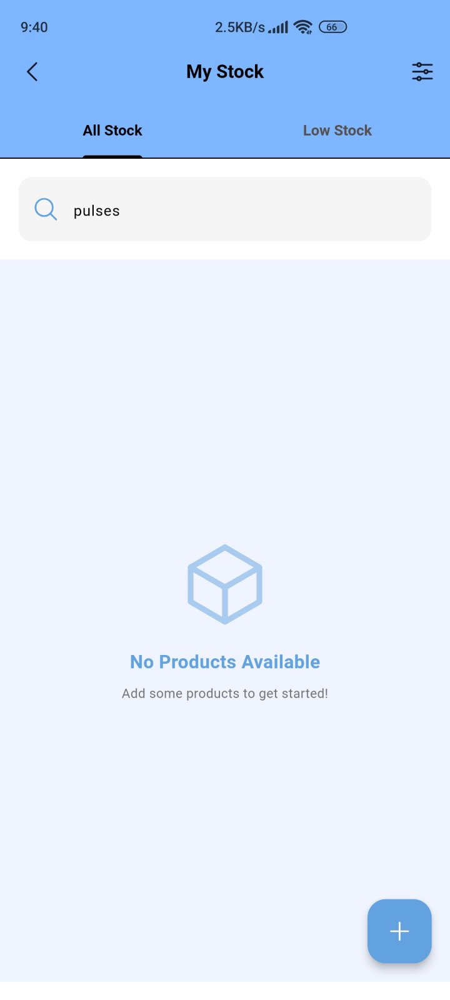
##### Search Functionality:

- Tap the search bar and start typing the product name or barcode.

- The list will update in real-time.
- If no products match, a "No Products Available" message will appear.

#### Low Stock Items
To view items with low inventory:

- Tap the **Low Stock** tab at the top of the screen.
- The list will update to show only items below your threshold.

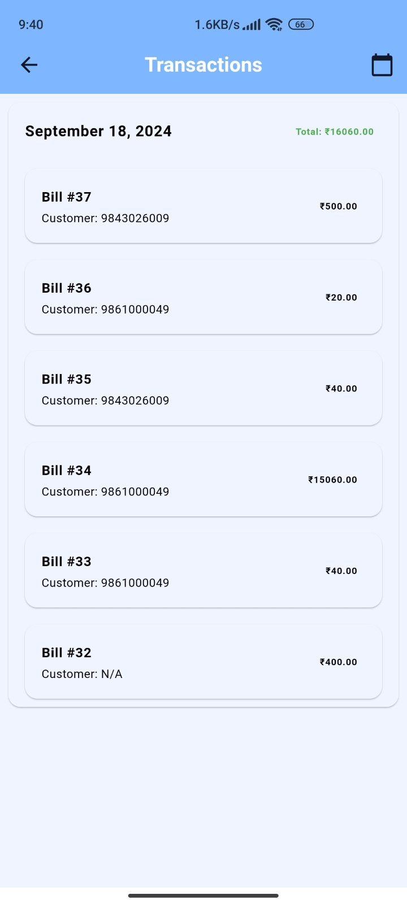
### 💼 My Transactions

The **My Transactions** page allows you to view and manage all sales transactions:

- See a list of all transactions, sorted by date.
- View total sales for each day.
- Access detailed information for each transaction.

#### Sorting Transactions
To sort transactions by date:

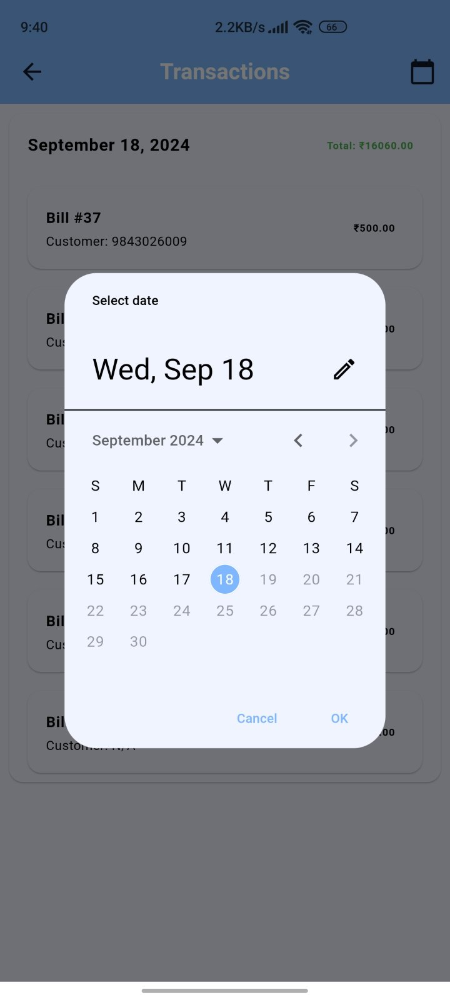

1. Tap the **calendar icon** at the top of the screen.
2. Select the desired date from the calendar view.
3. The list will update to show only transactions from the selected date.

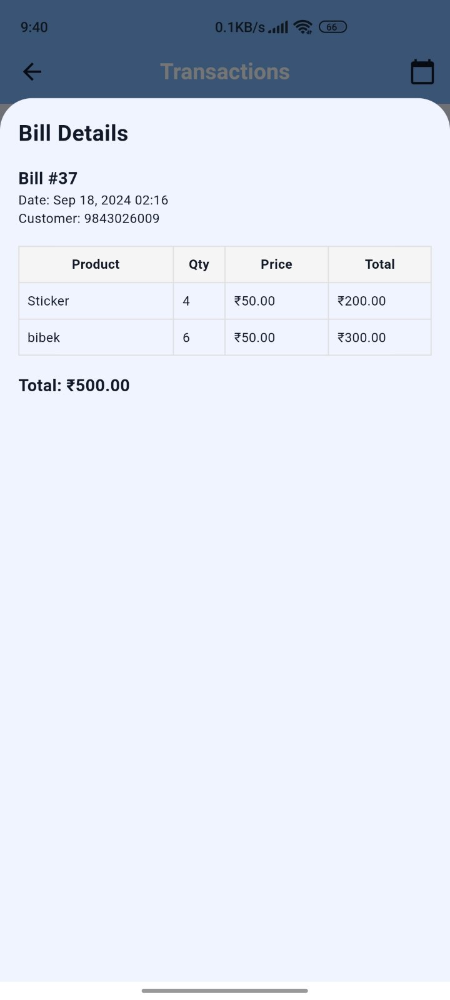

#### Transaction Details
To view details of a specific transaction:

Tap the desired transaction and then a detailed view will open, showing:

   - **Bill Number**  
   - **Date and Time of Sale**  
   - **Customer Information** (if available)  
   - **List of Items Sold** (including quantity and price)  
   - **Total Bill Amount**  

### 👥 My Customers

The **My Customers** page allows you to view, manage, and interact with customer details and their purchase history.

#### Main Features
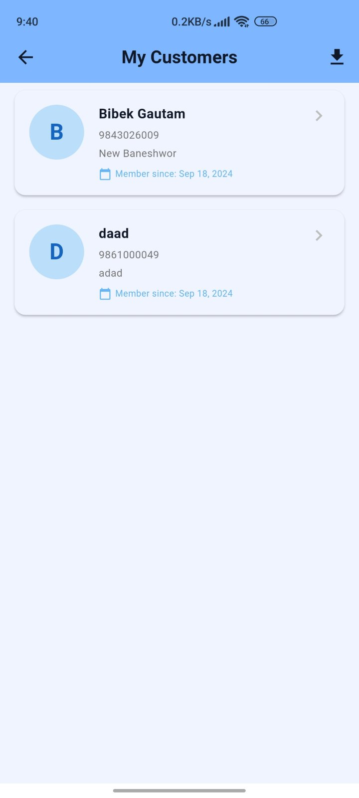

1. **Customer Overview**:

      - Displays a list of customers, including:
      - Name (First letter as a circular avatar)
      - Phone Number
      - Address (optional)
      - Membership Date

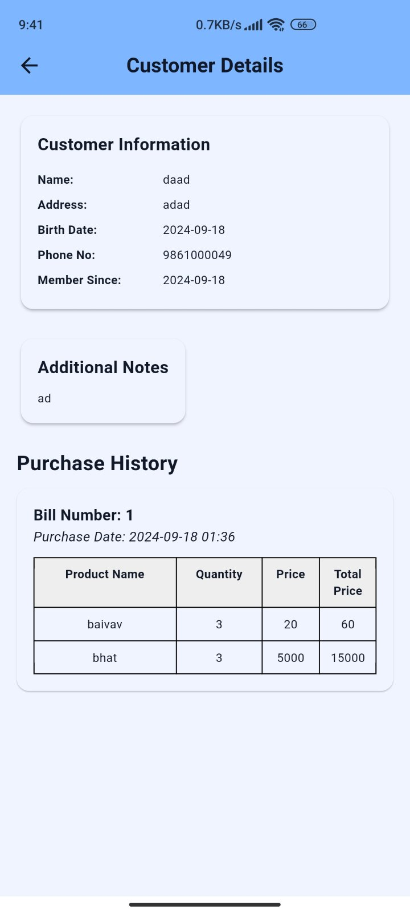

2. **Detailed Customer View**:

      - Clicking on a customer shows their full details, including:
      - Name, phone, address, membership date.
      - **Purchase History**: Previous purchases with date, items, and total amount spent.

#### Navigation:
- Tap the **back arrow** in the top-left to return to the customer list.
- Use the side drawer for options to manage or add new customers.

### 🔄 Return Item

The **Return Item** feature allows users to return products from a specific bill by entering the associated bill number. Follow these steps to use this feature:

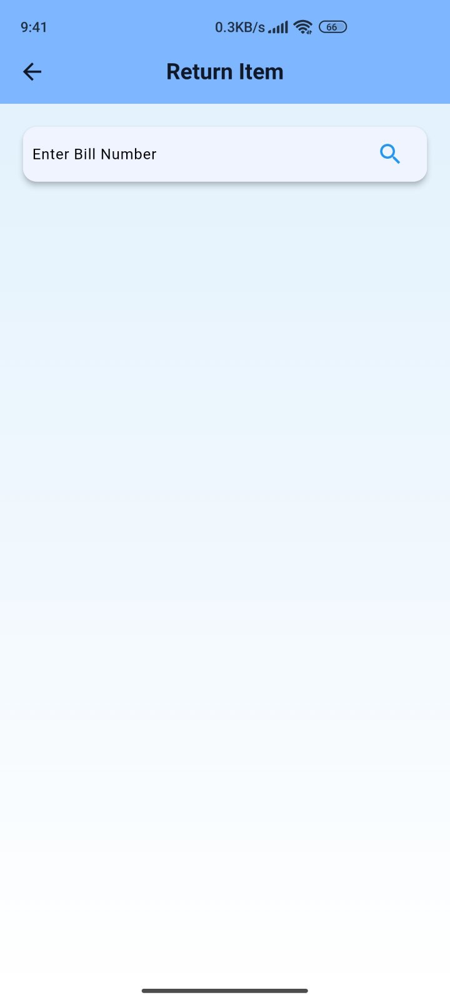

1. **Enter Bill Number**

      - On the **Return Item** page, locate the input field labeled "Enter Bill Number".
      - Enter the bill number of the transaction for which you want to return items.
      - Click the search icon or press Enter.

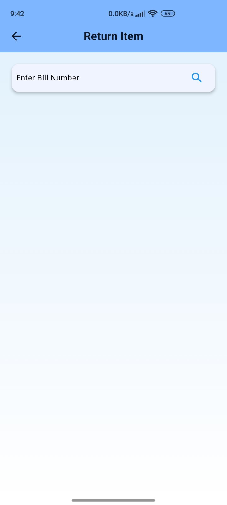

2. **Bill Validation**
      - **If the bill is not found**: The page will display a "No bills found" message.
      - **If the bill is valid**: You'll be taken to the Return Product Page.

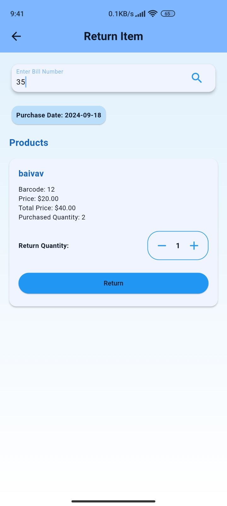

3. **Return Product Page**
      - Upon entering a valid bill number, the page will display details of the purchased products.

4. **Specifying Return Quantity**
      - Use the `+` and `-` buttons next to each product to adjust the return quantity.
      - The return quantity cannot exceed the originally purchased quantity.

5. **Processing the Return**
      - After selecting the quantity to return, click the **Return** button at the bottom of the page.
      - The system will process the return and update inventory and financial records.

> 💡 **Tips**:
> - Always double-check the bill number before processing returns.
> - Verify return quantities to avoid errors.
> - Contact support if you encounter any issues.

### ➕ Add Products

The **Add Product** page allows users to either scan or manually enter the barcode of a product. Based on whether the product exists in the system, users can either update its details or add it as a new product.

1. #### **Scan or Enter Barcode**:
      - 📷 **Scan Barcode**: Tap the "Scan Barcode" button to scan the product's barcode using your device's camera.
      - 🔢 **Enter Barcode**: If you prefer manual entry, type the barcode in the "Enter Barcode" field and tap the search icon.

      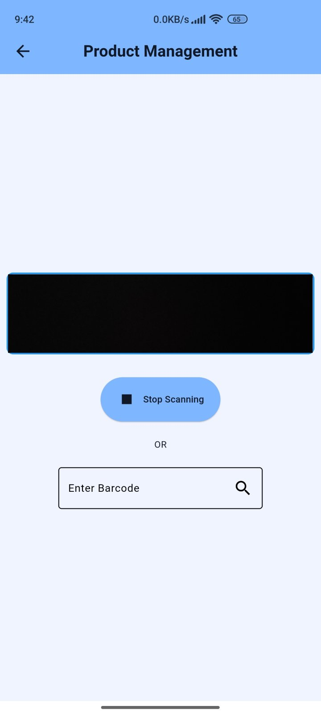

2. #### **If Barcode Exists (Update Product)**:
      - When the entered/scanned barcode is found in the system, the app will navigate to the **Update Product** page.
      - The following fields will be available for updating:
        - **Barcode**: The existing barcode is shown but cannot be changed.
        - **Product Name**: Enter or update the product name.
        - **MRP**: Update the Maximum Retail Price (MRP) of the product.
        - **Quantity**: Update the stock quantity to be added.
        - **Category**: (Optional) Select the product category if needed.
        - **Cost Price**: Set the cost price under **Additional Details**.
        - **Product Image**: Choose an image by either uploading from the gallery or taking a new picture if needed.

      - **Update Product**: Once all the details are updated, tap **Update Product** to save changes. A success message will be displayed.
      - **Cancel**: Tap **Cancel** to discard changes and return to the previous page.

   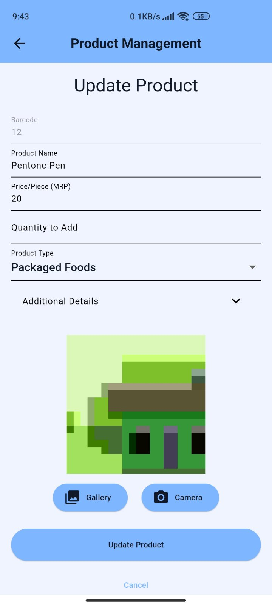

3. #### **If Barcode is Not Found (Add Product)**:
      - When the barcode is not found, the app will prompt you to add the product as a new entry.
      - Fill in the following fields:
         - **Barcode**: Enter the product's barcode.
         - **Product Name**: Enter the name of the product.
         - **MRP**: Specify the Maximum Retail Price (MRP).
         - **Quantity**: Enter the initial stock quantity.
         - **Category**: (Optional) Select a product category.
         - **Cost Price**: Enter the cost price under **Additional Details**.
         - **Product Image**: Add an image by uploading from the gallery or capturing a new image.

      - **Add Product**: After filling in all necessary details, tap **Add Product** to save the new product. A success message will confirm the addition.
      - **Cancel**: Tap **Cancel** to abort the product addition process.

    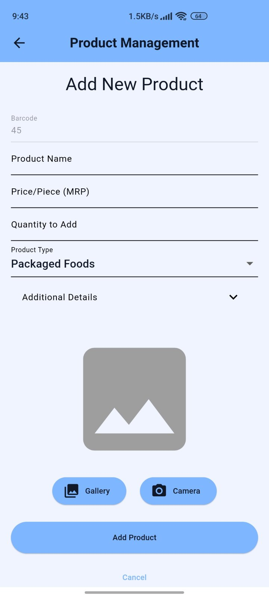

4. **Navigation**:
      - Use the **back arrow** button in the top-left corner to go back to the previous page at any point.

## 📈 Analytics Dashboard

The Analytics Dashboard provides a comprehensive overview of your business performance. To access this feature, tap the "Analytics" icon at the bottom of the screen.

### 1. Financial Overview

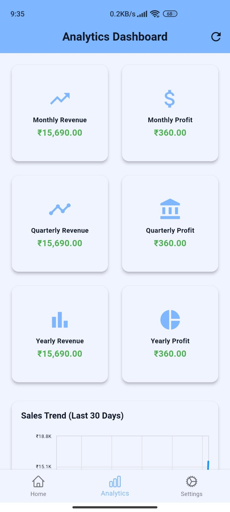

The dashboard displays key financial metrics in easy-to-read cards:

- 💰 **Monthly Revenue**: Total revenue for the current month
- 📈 **Monthly Profit**: Total profit for the current month
- 💼 **Quarterly Revenue**: Total revenue for the current quarter
- 📊 **Quarterly Profit**: Total profit for the current quarter
- 🏦 **Yearly Revenue**: Total revenue for the current year
- 💹 **Yearly Profit**: Total profit for the current year

All figures are displayed in Nepali Rupees (₹).

### 2. Sales Trend Graph

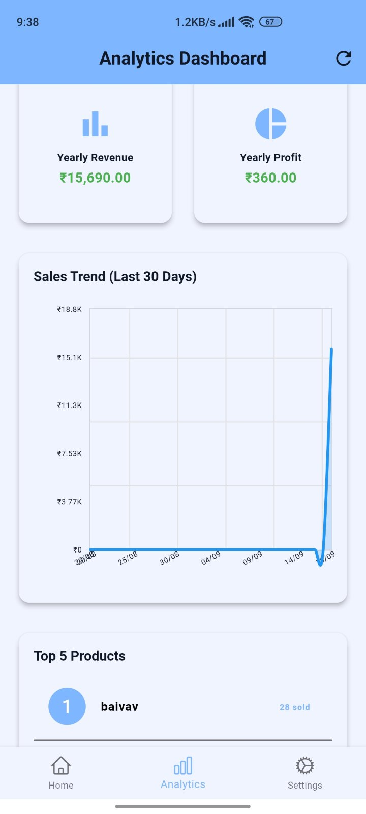

A line graph shows your sales trend for the last 30 days:

- The X-axis represents dates
- The Y-axis represents sales amounts
- The graph provides a visual representation of daily sales fluctuations

### 3. Top 5 Products

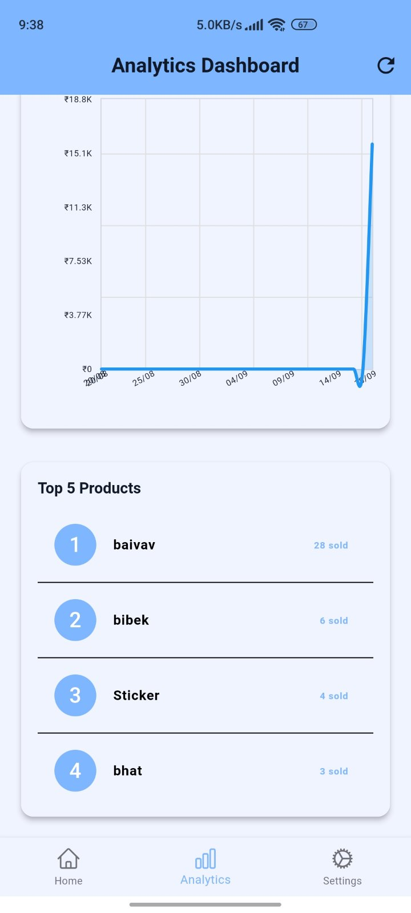

This section lists your best-selling products:

- Products are ranked from 1 to 5 based on sales volume
- Each product shows the number of units sold

### How to Use

1. **View Financial Metrics**: Simply read the values on each card for a quick overview of your business performance.

2. **Analyze Sales Trend**: 
      - Look at the line graph to identify peak sales days
      - Notice any patterns or irregularities in your sales

3. **Monitor Top Products**:
      - Check which products are selling best
      - Use this information for inventory management and marketing strategies

### Tips

- Regularly check the Analytics Dashboard to stay informed about your business performance
- Use the yearly and quarterly data to set long-term business goals
- Pay attention to the Top 5 Products to ensure you always have sufficient stock of popular items

### Refreshing Data

To get the latest data, tap the refresh icon (circular arrow) in the top right corner of the screen.

## ⚙️ Settings

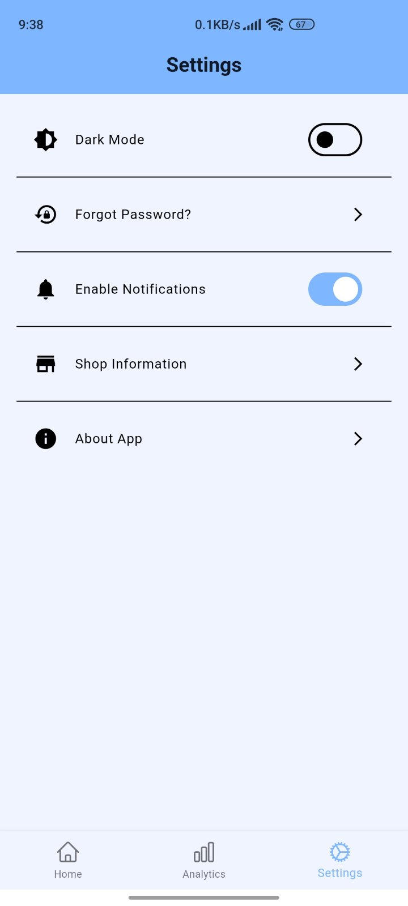

The Settings screen allows you to customize your Hisab Kitab app experience and access important account and app information. To access Settings, tap the gear icon at the bottom right of the screen.

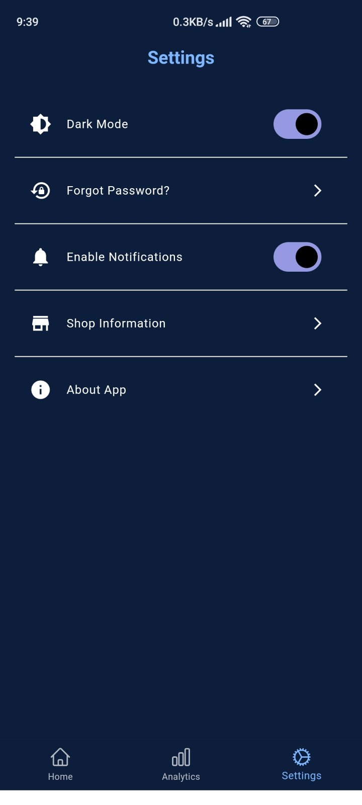

### 1. 🌓 Dark Mode

Toggle Dark Mode on or off to change the app's appearance. Dark Mode can reduce eye strain in low-light conditions.

- To enable: Tap the toggle switch next to "Dark Mode"
- To disable: Tap the toggle switch again

### 2. 🔑 Reset Password

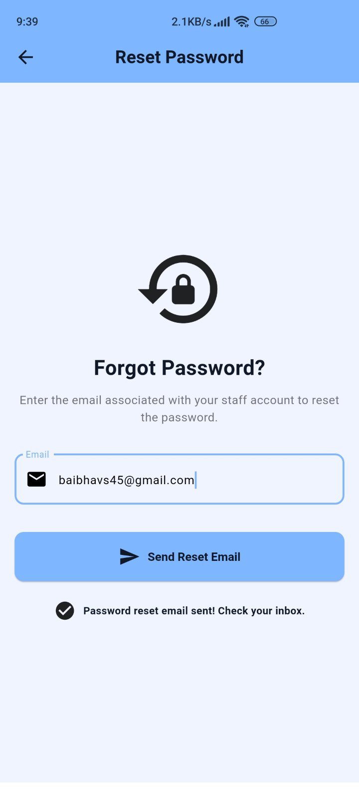

If you've forgotten your password, you can easily reset it:

1. Tap "Forgot Password?"
2. On the Reset Password screen, enter the email associated with your staff account
3. Tap "Send Reset Email"
4. Check your inbox for the password reset email and follow the instructions

### 3. 🔔 Enable Notifications

Stay updated with important app notifications:

- To enable: Tap the toggle switch next to "Enable Notifications"
- To disable: Tap the toggle switch again

### 4. 🏪 Shop Information

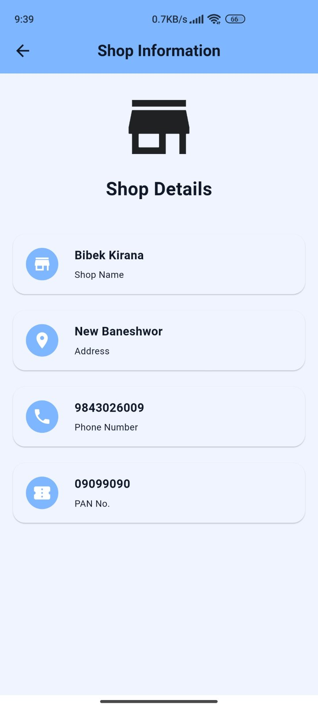

View and edit your shop details. Tap "Shop Information" to access this section.

### 5. ℹ️ About App

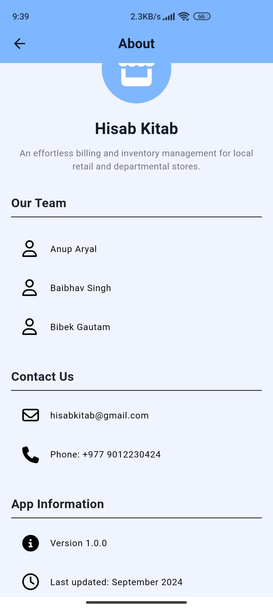

Access information about the Hisab Kitab app:

- App description
- Development team
- Contact information
- Current version
- Last update date

To view this information, tap "About App" in the Settings menu.

#### Additional Information

##### 📞 Contact Us

If you need assistance, you can reach out to the Hisab Kitab team:

- 📧 Email: hisabkitab@gmail.com
- 📱 Phone: +977 9012230424

##### 🔢 App Version

You can find the current app version in the "About App" section. As of the last update, the app version is 1.0.0.

##### 🔄 Update Frequency

The app is regularly updated to improve performance and add new features. Check the "Last updated" information in the "About App" section to see when the most recent update was released.

---

Thank you for choosing HisabKitab for your business management needs!